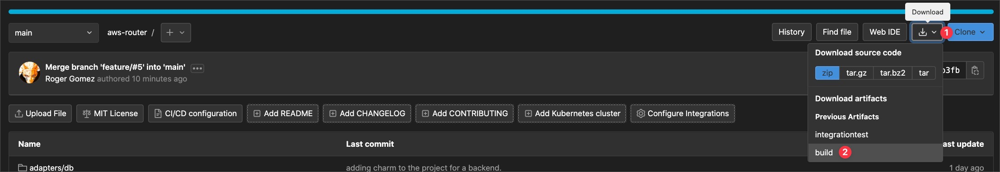

# AWS Router

Get AWS routing information from the CLI.
Dump the all AWS routing information into a CSV, Excel or DB.
If the information is inside a DB, get answers to questions like:

* What is the path from IP-A to IP-B?
* What is the correct table to attach the VPC if it needs inspection, or LB or direct access to IP-A or IP-B.

## How to install

The easiest way to install is downloading the compiled files for your OS.
If you are using Windows, Mac OSX or Linux there is already a compiled binary as the artifacts of the build process.

Unzip the file and select the correct binary for your case.

## AWS Credentials

Credentials need to have permissions for:

* DescribeTransitGateways
* DescribeTransitGatewayRouteTables
* SearchTransitGatewayRoutes

For all objects.

This tool is used from the CLI so test you have access before trying this tool:

* `aws ec2 describe-transit-gateways`

AWS Router should be able to identify the credentials and try to use them.

