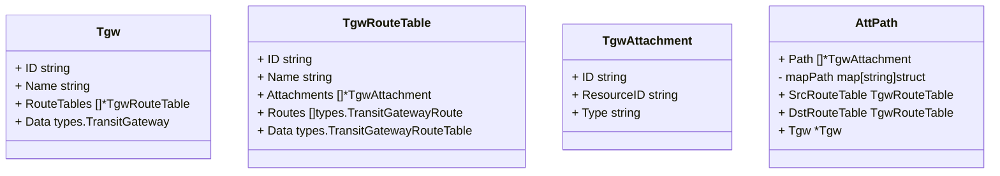
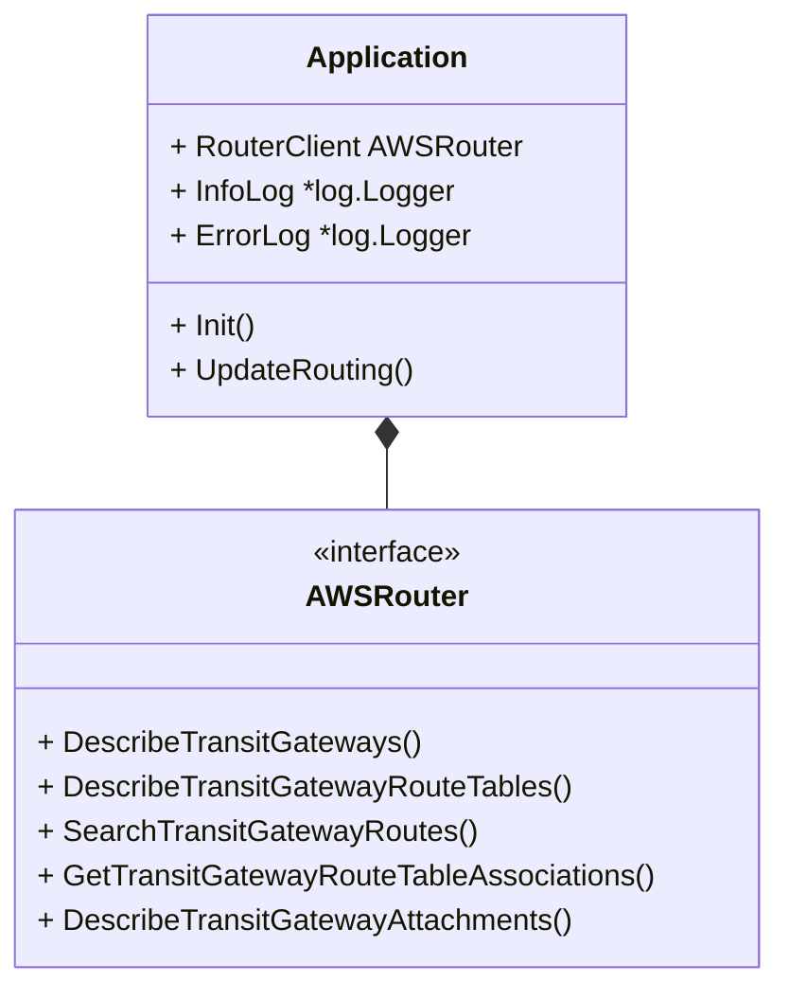

# AWS Router

Get AWS routing information from the CLI.
Dump the all AWS routing information into a CSV, Excel or DB.
It can also answer questions like:

* What is the path from IP-A to IP-B?
* Draw traffic from IP-A to IP-B.

## How to install

### Install with Go

With Go installed just run:

1. First download the repo.
2. Build the project: `go build -o awsrouters *.go`

## AWS Credentials

Credentials need to have permissions for:

* DescribeTransitGateways
* DescribeTransitGatewayRouteTables
* SearchTransitGatewayRoutes
* GetTransitGatewayRouteTableAssociations
* DescribeTransitGatewayAttachments

Is recommended to have allow access to all resources.

This tool is used from the CLI, so test you have access before trying this tool for example with `aws ec2 describe-transit-gateways`. This tool will identify the default AWS credentials on the current session.

## Architecture

